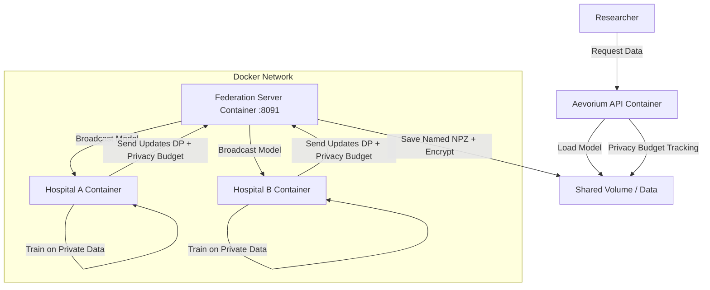

# Aevorium Architecture

Aevorium is a federated learning platform designed to train generative models on distributed, sensitive healthcare data without raw data ever leaving the source institutions.

## High-Level Overview

The system follows a **Hub-and-Spoke** federated learning topology, fully containerized for deployment:

- **Federation Server (Hub)**: Orchestrates training rounds via Flower framework (port 8091). Runs in a Docker container.
- **Training Nodes (Spokes)**: Run within secure environments at data holder sites. Train locally and send only DP-noised weight updates. Run in Docker containers.
- **API Layer**: FastAPI v2.0.0 endpoints for researchers (port 8000). Runs in a Docker container.



## Core Components

### 1. Federation Server (`server/`)
- **Framework**: Built on **Flower (flwr)** with `FedAvg` strategy.
- **Port**: 8091 (configurable via `SERVER_PORT` env var)
- **Rounds**: Configurable via `NUM_ROUNDS` env var (default: 5)
- **Features**:
    - Named NPZ model saves (prevents parameter mismatches)
    - Aggregated metrics logging (avg loss per round)
    - Automatic model encryption via Fernet
- **Infrastructure**: Dockerized (`infra/Dockerfile.server`)

### 2. Training Node (`node/`)
- **Framework**: PyTorch + Flower Client
- **Model**: **Tabular Diffusion Model** with support for **Mixed-Type Data**
- **Privacy**: **Opacus** DP-SGD with configurable noise/clipping + privacy budget tracking
- **Preprocessing**: `DataPreprocessor` with QuantileTransformer for skewed features
- **Configuration** (via environment variables):
    - `TRAINING_EPOCHS`: Local epochs per round (default: 20)
    - `DP_NOISE_MULTIPLIER`: Privacy noise level (default: 0.3)
    - `DP_MAX_GRAD_NORM`: Gradient clipping norm (default: 1.0)
    - `BATCH_SIZE`: Training batch size (default: 32)
- **Infrastructure**: Dockerized (`infra/Dockerfile.node`)

### 3. Generative Model (`common/model.py`)
- **Architecture**: Enhanced DDPM adapted for tabular data
- **Input Dimension**: 31 features (9 continuous + 22 one-hot categorical)
- **Model Hyperparameters**:
    - Hidden dimension: 512
    - Time embedding: 128
    - Depth: 6 residual blocks
    - Dropout: 0.1
    - Timesteps: 1500
- **Layers**: ResNet-style blocks with `GroupNorm` (Opacus compatible) + SiLU activation
- **Noise Schedules**: Linear (default) or Cosine (Nichol & Dhariwal)
- **Sampling**: DDPM or **DDIM** (faster, configurable steps/eta)
- **Loss**: Huber (smooth L1) for robustness to outliers

### 4. Data Schema (`common/schema.py`)
The schema defines all features for the healthcare synthetic data:

**Continuous Features (9):**
| Feature | Range | Description |
|---------|-------|-------------|
| Age | 18-90 | Patient age in years |
| BMI | 15-50 | Body Mass Index |
| BloodPressure | 80-200 | Systolic BP in mmHg |
| Glucose | 50-400 | Blood glucose mg/dL |
| EncounterCount | 0-500 | Total healthcare encounters |
| MedicationCount | 0-100 | Number of medications |
| ConditionCount | 0-30 | Number of diagnosed conditions |
| TotalCost | 0-300,000 | Total healthcare costs ($) |
| ProcedureCount | 0-200 | Number of procedures |

**Categorical Features (5):**
| Feature | Categories |
|---------|------------|
| Gender | Male, Female, Other |
| Diagnosis | Diabetes, Hypertension, Healthy, HeartDisease, ChronicKidneyDisease, Cancer |
| EncounterType | wellness, ambulatory, outpatient, urgentcare, emergency, inpatient |
| HasAllergies | Yes, No |
| RiskLevel | Low, Medium, High |

### 5. Preprocessing (`common/preprocessing.py`)
- **StandardScaler**: For normal continuous features (Age, BMI, BP, Glucose)
- **QuantileTransformer**: For skewed features (EncounterCount, MedicationCount, ConditionCount, TotalCost, ProcedureCount) - maps to normal distribution
- **OneHotEncoder**: For categoricals with predefined categories from schema
- **Persistence**: Preprocessor saved to `MODEL_DIR/preprocessor.joblib` for consistent inverse transforms

### 6. Security & Governance (`common/`)
- **Encryption**: Global model weights encrypted at rest using `Fernet` (symmetric)
- **Audit Log**: JSON-based trail of all critical events (`audit_log.json`)
- **Privacy Budget Tracking**: `PrivacyBudgetTracker` class tracks cumulative ε across rounds
    - Per-round epsilon recording
    - Budget limit enforcement
    - Remaining rounds estimation
    - Persistent state in `privacy_budget.json`

### 7. API (`api/`)
- **Framework**: FastAPI 2.0.0
- **Port**: 8000
- **Endpoints**:
    - `POST /train`: Trigger training session
    - `POST /generate`: Generate synthetic data
    - `GET /audit-log`: View audit trail
    - `GET /privacy-budget`: Check privacy budget status
    - `POST /privacy-budget/set-limit`: Set total privacy budget
    - `POST /privacy-budget/reset`: Reset privacy tracker
    - `GET /health`: Health check endpoint

## Data Flow

1.  **Initialization**: Server starts on port 8091 and waits for clients.
2.  **Data Loading**: Clients load real Synthea CSV data from `data/csv/` or generate synthetic reference data.
3.  **Preprocessing**: `DataPreprocessor` fits on local data using QuantileTransformer for skewed features.
4.  **Round Start**: Server broadcasts current global model to available clients.
5.  **Local Training**:
    - Client wraps model with Opacus `PrivacyEngine` (fresh copy each round)
    - Trains for configurable epochs using cosine noise schedule
    - Gradients clipped and noised per DP-SGD
    - Privacy expenditure recorded to `PrivacyBudgetTracker`
6.  **Aggregation**: Clients send weights + metrics back. Server averages via FedAvg.
7.  **Checkpoint**: Server saves named NPZ (`global_model_round_X.npz`) and encrypts.
8.  **Generation**: 
    - Load encrypted model, decrypt in memory
    - Sample noise and denoise using DDIM (200 steps, eta=0.3)
    - Apply categorical softmax sampling (temperature=0.2)
    - Clip continuous features to valid ranges
    - Output realistic synthetic patients

## Directory Structure

```
Aevorium/
├── api/main.py           # FastAPI endpoints
├── common/
│   ├── config.py         # Path configuration
│   ├── data.py           # Synthea data loading + synthetic generation
│   ├── governance.py     # Audit logging + privacy budget tracking
│   ├── model.py          # TabularDiffusionModel + DiffusionManager
│   ├── preprocessing.py  # DataPreprocessor with QuantileTransformer
│   ├── schema.py         # Feature definitions + ranges
│   └── security.py       # Fernet encryption/decryption
├── data/csv/             # Synthea CSV files (patients, conditions, etc.)
├── node/client.py        # Flower training client with Opacus DP
├── server/server.py      # Flower federation server
├── scripts/              # Utility scripts (metrics, validation, etc.)
├── tests/                # pytest test suite
└── infra/                # Dockerfiles for deployment
```

## Tech Stack

| Component | Technology | Version |
|-----------|------------|---------|
| Federated Learning | Flower (flwr) | ≥1.5.0 |
| ML Framework | PyTorch | ≥2.0.0 |
| Differential Privacy | Opacus | ≥1.4.0 |
| API | FastAPI + Uvicorn | ≥0.100.0 |
| Preprocessing | scikit-learn | ≥1.3.0 |
| Encryption | cryptography (Fernet) | ≥41.0.0 |
